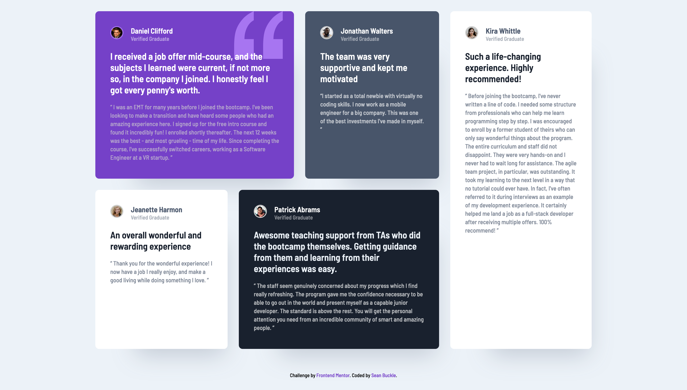

# Frontend Mentor - Testimonials grid section solution

This is a solution to the [Testimonials grid section challenge on Frontend Mentor](https://www.frontendmentor.io/challenges/testimonials-grid-section-Nnw6J7Un7). Frontend Mentor challenges help you improve your coding skills by building realistic projects. 

## Table of contents

- [Overview](#overview)
  - [The challenge](#the-challenge)
  - [Screenshot](#screenshot)
  - [Links](#links)
- [My process](#my-process)
  - [Built with](#built-with)
  - [Useful resources](#useful-resources)
- [Author](#author)

## Overview

### The challenge

Users should be able to:

- View the optimal layout for the site depending on their device's screen size

### Screenshot

### Links

- Solution URL: [https://github.com/seanbuckle/Testimonials-grid-section](https://github.com/seanbuckle/Testimonials-grid-section)
- Live Site URL: [https://seanbuckle.github.io/Testimonials-grid-section/](https://seanbuckle.github.io/Testimonials-grid-section/)

## My process

### Built with

- Semantic HTML5 markup
- CSS custom properties
- Flexbox
- CSS Grid
- Mobile-first workflow
- SCSS/SASS CSS preprocessor

### Useful resources

- [web.dev](https://web.dev)
- [MDN Web Docs](https://developer.mozilla.org)

## Author
- Frontend Mentor - [@seanbuckle](https://www.frontendmentor.io/profile/seanbuckle)
- Twitter - [@seanlbuckle](https://www.twitter.com/seanlbuckle)
- LinkedIn - [Sean Buckle](https://www.linkedin.com/in/seanbuckle/)
